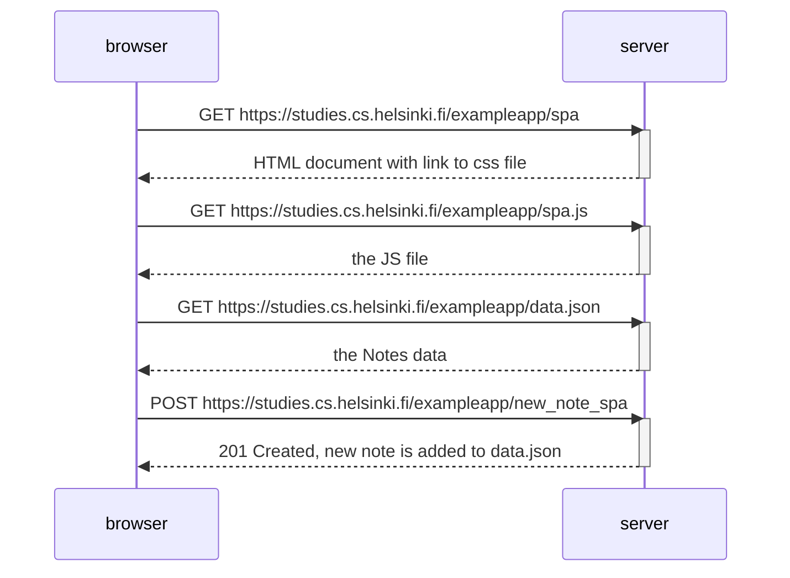

```mermaid
sequenceDiagram

    participant browser
    participant server

    browser->>server: GET https://studies.cs.helsinki.fi/exampleapp/spa
    activate server
    server-->>browser: HTML document with link to css file
    deactivate server

    browser->>server: GET https://studies.cs.helsinki.fi/exampleapp/spa.js
    activate server
    server-->>browser: the JS file
    deactivate server

    browser->>server: GET https://studies.cs.helsinki.fi/exampleapp/data.json
    activate server
    server-->>browser: the Notes data
    deactivate server

    browser ->>server: POST https://studies.cs.helsinki.fi/exampleapp/new_note_spa
    activate server
    server -->> browser : 201 Created, new note is added to data.json
    deactivate server
```